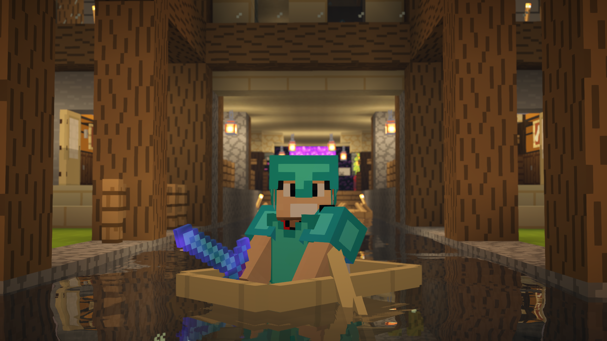
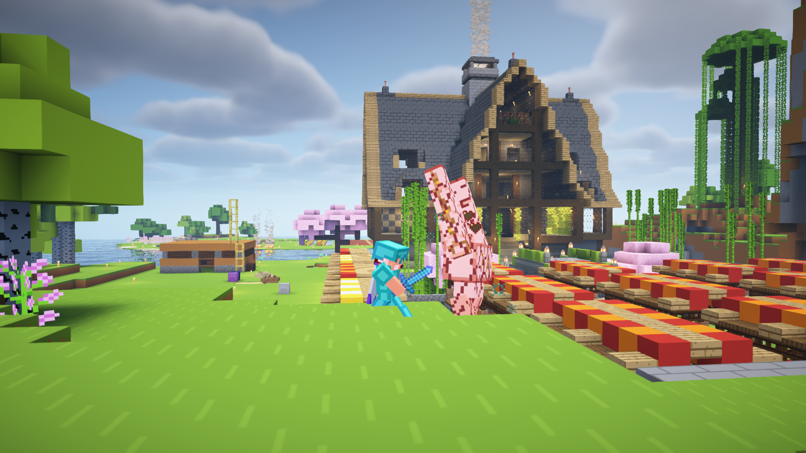
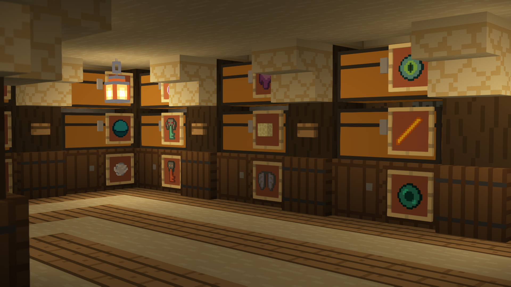
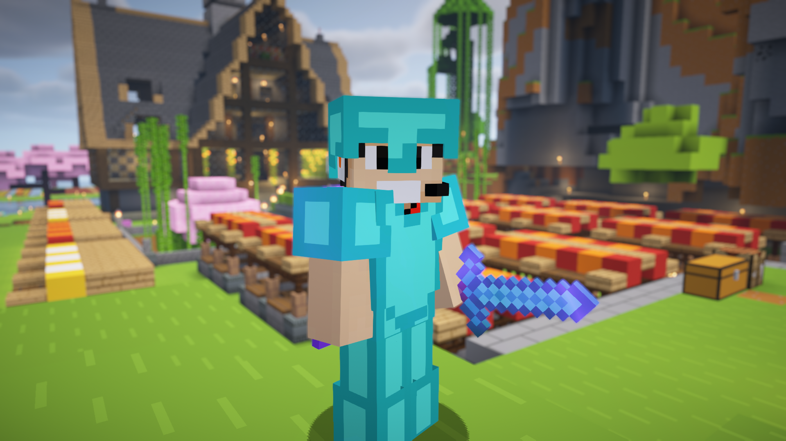

# Bem-vindo ao Friends Realms!

Bem-vindo ao **Friends Realms**, um servidor Minecraft Realms dedicado a oferecer uma experiência incrível e colaborativa para todos os jogadores. Este README é a sua porta de entrada para o nosso mundo virtual! Aqui, você encontrará uma visão geral do servidor, algumas regras importantes, e uma amostra do que o nosso mundo tem a oferecer.

## O Que Esperar

### 1. **Visão Geral do Mundo**
Explore a beleza e a diversidade do nosso mundo em **Friends Realms**. Desde vastas paisagens até construções impressionantes, o nosso servidor é um lugar onde a criatividade não tem limites.

### 2. **Construções Destaque**
Aqui estão algumas das construções mais notáveis feitas por nossos talentosos jogadores:

- **Castelo dos Sonhos**: Um majestoso castelo que é o coração de nossa comunidade.
- **Cidade Flutuante**: Uma cidade futurista suspensa nas nuvens.
- **Fazenda Comunitária**: Um local onde todos podem contribuir e obter recursos.

### 3. **Conheça os Administradores**
Os administradores são responsáveis por manter o servidor funcionando e garantir uma experiência positiva para todos os jogadores. Conheça a equipe:

- **ADM**: SLOWboxGG - Responsável pela Construção
- **Moderador 1**: Serya012 - Responsável por Construção/Farms/Exploração/Combate
- **Moderador 2**: Scroll_rms - Responsável por Exploração

## Regras Importantes

Para garantir que todos tenham uma experiência divertida e segura, siga estas regras básicas:

### O que **Pode** Fazer:
1. **Construir em Áreas Vazias**: Construa em locais não ocupados por outros jogadores.
2. **Ajudar nas Farms Comunitárias**: Contribua para o bem-estar da comunidade.
3. **Participar de Projetos Coletivos**: Envolva-se em eventos e construções comunitárias.
4. **Explorar o Mundo**: Descubra novos lugares e aproveite a aventura.

### O que **Não Pode** Fazer:
1. **Não Griefar**: Não destrua ou danifique construções alheias.
2. **Sem Cheats**: Não use mods ou hacks para obter vantagens.
3. **Respeitar o Espaço Pessoal**: Não invada áreas privadas de outros jogadores.
4. **Não Fazer Spam**: Evite mensagens repetitivas ou perturbadoras.
5. **Sem Baderna**: Mantenha um comportamento respeitoso e não cause desordem.
   
6. **Não Usar Explosivos**: Evite o uso de TNT ou outros explosivos perto de construções.
7. **Não Construir em Áreas Protegidas**: Respeite as áreas reservadas para projetos comunitários.
8. **Sem Spam no Chat**: Evite mensagens repetitivas ou perturbadoras.
9. **Sem Comportamento Ofensivo**: Mantenha a linguagem apropriada e respeite todos os jogadores.
10. **Não Invadir Quartos Alheios**: Não entre em áreas privadas de outros jogadores ou roube itens.
11. **Respeitar os Baús Comunitários**: Use os baús comunitários com respeito e moderação.
    

Para uma lista completa de regras e detalhes, consulte a [Política de Conduta](https://github.com/serya012/minecraft-realms/blob/main/REGRAS.md).

## Como Começar

1. **Conecte-se ao Servidor**: 
   - Após o seu convite, o administrador adicionará você à lista de amizades do Minecraft e enviará um convite para o nosso Realms. Aceite o convite para se conectar.

2. **Leia o Livro de Regras**: 
   - No spawn, você encontrará um livro com as regras do servidor. Leia-o para se familiarizar com as diretrizes.

3. **Explore e Divirta-se**: 
   - Comece a explorar, construir e interagir com a comunidade!

## Dúvidas e Sugestões

Se você tiver alguma dúvida ou sugestão, entre em contato com os administradores. Estamos sempre disponíveis para ajudar e ouvir suas opiniões.

**Mais uma vez, bem-vindo ao Friends Realms!** Aproveite sua estadia e boas aventuras!

---
**Equipe Friends Realms**
